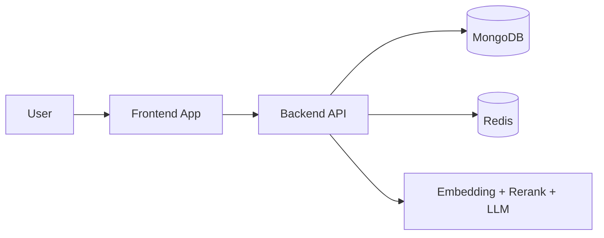

<h3>Notebook-first AI research workspace with grounded answers and citations</h3>

 

 

---

## What Is Synapse?

Synapse is a full-stack RAG workspace for research-heavy workflows.
Users can upload source files, organize notebooks, and ask questions that are answered with retrieved context and citations.

## Architecture At A Glance

- Frontend: Cinematic, responsive React application for notebook management, sources, auth/profile flows, and chat UX.
- Backend: Node.js + Express API that performs PDF ingestion, chunking, embedding, retrieval, reranking, and grounded response generation.
- Infra: MongoDB for persistent data, Redis for cache/performance, container-friendly deployment.

## Start Here

This root README is your launch point. Detailed implementation docs are split by layer for faster onboarding:

1. Frontend docs: [client/README.md](client/README.md)
2. Backend docs: [server/README.md](server/README.md)

## Quick Local Run

1. Start the backend from [server](server).
2. Start the frontend from [client](client).
3. Open the app and begin the notebook workflow.

For setup commands, env variables, architecture notes, and troubleshooting:

- [client/README.md](client/README.md)
- [server/README.md](server/README.md)

---

## Navigation

- Live app: [https://synapse-nu-sable.vercel.app/](https://synapse-nu-sable.vercel.app/)
- Frontend deep dive: [client/README.md](client/README.md)
- Backend deep dive: [server/README.md](server/README.md)

  

