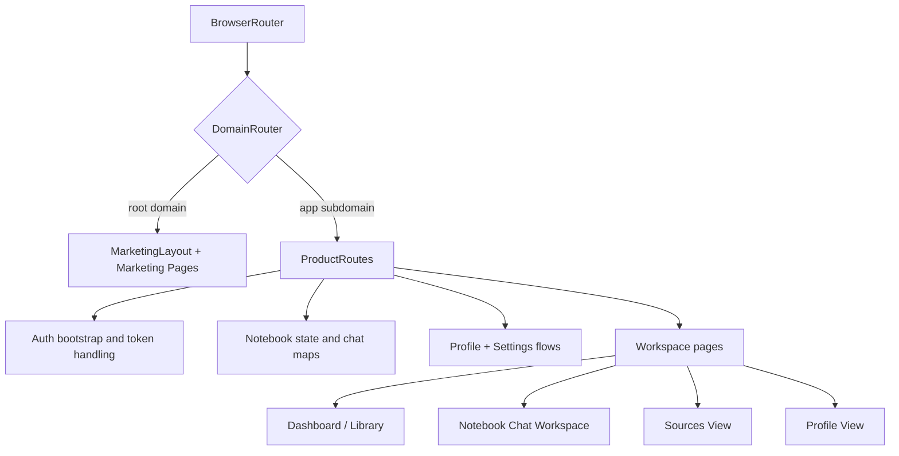

# Synapse UI Frontend

The client app is the visual command center for a notebook-first RAG experience.
It combines a cinematic marketing surface with a production workspace where users can:

- authenticate
- create and organize notebooks
- upload sources
- ask grounded questions
- review citation-backed chat responses
- manage profile and preferences

This README is intentionally detailed so new contributors can move from zero to productive quickly.

## Table of Contents

- [Vision](#vision)
- [Tech Stack](#tech-stack)
- [Frontend Architecture](#frontend-architecture)
- [Domain Routing Strategy](#domain-routing-strategy)
- [UI and Design System](#ui-and-design-system)
- [Core User Workflows](#core-user-workflows)
- [API Integration Contract](#api-integration-contract)
- [State Model](#state-model)
- [Local Development](#local-development)
- [Testing and Quality](#testing-and-quality)
- [Build and Production](#build-and-production)
- [Troubleshooting](#troubleshooting)
- [Roadmap Ideas](#roadmap-ideas)

## Vision

Synapse UI is designed with a simple product thesis:

"Research should feel like momentum, not friction."

The app emphasizes:

- speed of question-to-answer loops
- high visual clarity for source context
- confidence via citations
- notebook-centric organization that supports team workflows

## Tech Stack

- Runtime: React 19 + React Router 7
- Bundler: Vite 8
- Styling: Tailwind CSS + DaisyUI + custom CSS utility layers
- Networking: Axios and Fetch wrappers
- Markdown rendering: react-markdown + remark-gfm
- Linting: ESLint 9

## Frontend Architecture

The frontend is organized into clear domains:

- `src/pages`: route-level screens (marketing + product app)
- `src/components/app`: app-level reusable UI pieces (modals, sidebar, toasts)
- `src/components/bits`: low-level visual primitives (glass panels, reveal motion, glow buttons)
- `src/features`: feature-focused composition blocks
- `src/api`: backend communication layer
- `src/app`: application scaffolding (domain routing and context)

### High-Level Composition



## Domain Routing Strategy

The app uses host-based behavior split:

- root domain (for example `example.com`) serves marketing pages
- app subdomain (for example `app.example.com`) serves authenticated product routes

Routing helpers build cross-domain redirects so sign-in on marketing can jump users into app space with an auth token handoff.

## UI and Design System

The visual language follows a "kinetic radiance" approach:

- dark-first atmospheric surfaces
- orange energy accents for action hierarchy
- glassmorphism layers for depth
- cinematic gradients and radial coronas
- purposeful motion (reveal, drift, shimmer)

### Typography

- Display type: Manrope
- Body type: Inter

### Core Visual Tokens

- Surfaces: deep black stack (`--kr-surface`, `--kr-surface-low`, `--kr-surface-high`)
- Accent: warm orange ramp (`--kr-primary-fixed`, `--kr-primary-container`)
- Ghost outlines and luminous glows for contrast without hard framing

### UX Characteristics

- mobile + desktop adaptive layouts
- toast-based operation feedback
- quick-switch notebook navigation
- source mode switching (selected source vs all notebook sources)
- markdown response rendering for richer assistant output

## Core User Workflows

### 1. Authentication and Session Bootstrap

1. User signs up or logs in from marketing modal.
2. Backend returns JWT token.
3. Token is persisted in local storage.
4. Product app bootstraps user profile and notebooks.
5. User lands in `/app` routes.

### 2. Notebook Lifecycle

1. Create notebook.
2. Rename, duplicate, favorite, or share.
3. Open notebook workspace.
4. Upload sources.
5. Ask questions and grow chat history.

### 3. Source and Chat Flow

1. Source upload is bound to notebook.
2. Selected source can be targeted, or all notebook sources can be queried.
3. Assistant replies are shown with citation metadata.
4. History is loaded per notebook for continuity.

### 4. Profile and Preferences

1. User updates identity fields (username, email, bio, avatar).
2. User can switch preference theme and notification setting.
3. Password rotation is handled in dedicated secure flow.

## API Integration Contract

Frontend talks to backend via `/api/v1` base (proxied in dev by Vite):

- Auth: register, login, logout, profile, update profile, update password
- Notebooks: list, create, update, delete, duplicate, delete source
- Sources: upload PDF
- Chat: ask question, fetch notebook history

### Auth Header Pattern

Protected requests send:

`Authorization: Bearer <token>`

### Error Handling Pattern

API layer normalizes errors from:

- `errMessage`
- `message`
- generic network error

and surfaces a clean user-facing `Error` object used by toasts/status labels.

## State Model

Key in-memory state buckets in app shell:

- `user`, `token`, `authReady`
- `notebooks`
- `chatMap` (messages per notebook)
- `selectedSourceMap` (active source per notebook)
- `activityLog`
- operational status flags: `uploading`, `asking`, modal states

This keeps route transitions responsive while preserving notebook continuity.

## Local Development

### Prerequisites

- Node.js 18+
- npm 9+
- backend service running (default: `http://localhost:5000`)

### Install

```bash
npm install
```

### Start Dev Server

```bash
npm run dev
```

### Build Production Bundle

```bash
npm run build
```

### Preview Build

```bash
npm run preview
```

### Lint

```bash
npm run lint
```

### Environment Configuration

Vite reads `VITE_BACKEND_URL` to proxy `/api` requests.

Default fallback target:

`http://localhost:5000`

## Testing and Quality

There is no formal automated frontend test suite yet in this repository.
Current quality practice is a combination of linting and end-to-end smoke checks.

### Current Quality Gates

- ESLint (`npm run lint`)
- manual route-flow verification
- API contract verification against backend and Postman collection

### Recommended Manual Smoke Checklist

1. Register + Login + Logout flow.
2. Token handoff from marketing to app routes.
3. Notebook create/rename/delete/duplicate.
4. Source upload and source deletion.
5. Ask question in selected source mode.
6. Ask question in all sources mode.
7. Notebook history reload across refresh.
8. Profile update + password change.
9. Responsive checks on mobile and desktop breakpoints.

### Suggested Next Testing Upgrades

- Unit tests for API client and state reducers/helpers.
- Integration tests for critical route guards.
- E2E flows with Playwright or Cypress.

## Build and Production

### Production Characteristics

- Static bundle generated by Vite.
- API base is relative (`/api/v1`) for reverse-proxy friendliness.
- Auth token persistence relies on local storage token + backend verification.
- Frontend can be deployed behind Nginx/Vercel/Netlify while proxying API.

### Production Readiness Checklist

1. Set backend URL and CORS rules correctly.
2. Ensure HTTPS for token transport safety.
3. Validate subdomain DNS and routing (`app.<domain>`).
4. Enable cache-control strategy for static assets.
5. Integrate monitoring (frontend error tracking).

## Troubleshooting

### Frontend cannot reach backend

Symptoms:

- network error in API calls
- `ECONNREFUSED`

Checks:

1. Confirm backend is running on port `5000`.
2. Verify `VITE_BACKEND_URL` matches backend URL.
3. Confirm Vite proxy is active for `/api`.

### Token exists but app still redirects

Checks:

1. JWT secret and token validation on backend.
2. Expiration behavior of token.
3. Auth bootstrap call (`/users/profile`) response.

### Upload succeeds but no answers

Checks:

1. Source is attached to the intended notebook.
2. Selected source or all-source mode is correct.
3. Backend embedding + retrieval pipeline health.

## Roadmap Ideas

- Add robust automated UI test matrix.
- Introduce optimistic updates and offline recovery.
- Add richer citation interactions (jump to source page context).
- Add role-based UI capabilities for admin users.

---

The frontend is not just a shell around API calls. It is the product narrative layer: where retrieval quality, visual trust, and workflow momentum are turned into user confidence.
