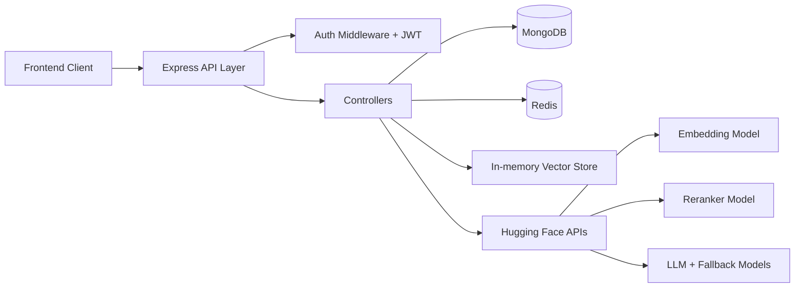

# Synapse Backend (RAG Engine + API Core)

This service is the intelligence backbone behind the Synapse notebook experience.
It handles:

- user identity and auth
- notebook and source management
- PDF ingestion and chunk embedding
- retrieval + reranking + grounded generation
- citation-aware chat history
- caching and rate limiting for production safety

If the frontend is the cockpit, this backend is the propulsion system.

## Table of Contents

- [System Purpose](#system-purpose)
- [Architecture at a Glance](#architecture-at-a-glance)
- [Tech Stack](#tech-stack)
- [Module Breakdown](#module-breakdown)
- [Data Models](#data-models)
- [RAG Pipeline Deep Dive](#rag-pipeline-deep-dive)
- [Caching Strategy](#caching-strategy)
- [Security and Guardrails](#security-and-guardrails)
- [API Surface](#api-surface)
- [Environment Variables](#environment-variables)
- [Local Setup](#local-setup)
- [Testing Strategy](#testing-strategy)
- [Production Readiness Notes](#production-readiness-notes)
- [Operational Troubleshooting](#operational-troubleshooting)
- [Known Gaps and Recommended Next Steps](#known-gaps-and-recommended-next-steps)

## System Purpose

The backend exists to make document-grounded answers reliable, explainable, and scalable.

Primary design goals:

- correctness through source grounding
- latency control through caching
- safe multi-user isolation by ownership checks
- clean API contracts for frontend velocity

## Architecture at a Glance



## Tech Stack

- Runtime: Node.js + Express 5
- Database: MongoDB (Mongoose)
- Cache and limiter backend: Redis (ioredis)
- Auth: JWT + bcrypt
- File upload: Multer
- PDF parse: pdf-parse
- AI pipeline:
  - embeddings via Hugging Face inference
  - reranking via Hugging Face inference
  - answer generation via model router + fallback strategy

## Module Breakdown

- `server.js`: app bootstrap, route mounting, middleware wiring
- `controllers/`: request orchestration and business rules
- `routers/`: endpoint declaration and middleware composition
- `models/`: Mongo schemas for users/notebooks/pdfs/chats
- `middlewares/`: auth, error handler, rate limiter
- `utilities/`: PDF processing, vector search, HF client, async/error helpers
- `db/`: Mongo and Redis connections
- `postman/`: API test collection and environment

## Data Models

### User

Purpose: identity, login credentials, profile metadata, and preferences.

Core fields:

- `username` (unique)
- `email` (unique)
- `password` (bcrypt hash)
- `role` (`student` or `admin`)
- `bio`, `avatarUrl`
- `preferences`:
  - `theme`: dark/light
  - `notificationsEnabled`: boolean
- `passwordChangedAt`

### Notebook

Purpose: user-owned research workspace and source aggregation unit.

Core fields:

- `title`, `icon`
- `owner` (User reference)
- flags: `isShared`, `isFavorite`, `featured`
- `sources[]`:
  - `name`
  - `type` (default PDF)
  - `pdfId` (PDF reference)
  - `addedAt`

### PDF

Purpose: persistent source record + embedded vector payload.

Core fields:

- `filename`
- `path`
- `uploadedBy` (User reference)
- `embeddings[]`:
  - `chunkId`
  - `chunk`
  - `embedding[]`
  - `page`
  - `source`

### Chat

Purpose: durable interaction history and citation traceability.

Core fields:

- `user`
- `pdf`
- `notebook` (nullable)
- `question`
- `answer`
- `citations[]` (`page`, `source`)

Indexes:

- `{ user, notebook, createdAt }`
- `{ user, pdf, createdAt }`

## RAG Pipeline Deep Dive

### Ingestion Path

1. Authenticated user uploads PDF.
2. Server parses text from PDF pages.
3. Text is normalized and repeated-line noise is cleaned.
4. Content is chunked by approximate token windows.
5. Each chunk is embedded via HF embedding model.
6. Embeddings are persisted in Mongo (`PDF.embeddings`).
7. Embeddings are loaded into in-memory vector cache for search.
8. Source is attached to notebook.

### Retrieval + Generation Path

1. User asks question by `pdfId` or `notebookId`.
2. Query text is embedded.
3. Top-K chunk retrieval runs over selected PDF vectors.
4. Reranker narrows to top-N most relevant chunks.
5. Prompt is assembled with explicit source and page metadata.
6. LLM generates grounded answer.
7. Unique citations are extracted from reranked chunks.
8. Chat record is persisted and optionally cached.

### Prompting Contract

Prompt policy enforces:

- answer using supplied sources only
- clearly state when answer is absent in sources
- avoid fabricated citations
- concise markdown style when useful

## Caching Strategy

Redis is used in three major places:

- PDF ingestion dedupe cache:
  - key: `pdf:ingest:<userId>:<name>:<size>`
  - avoids repeated processing for same upload
- RAG response cache:
  - key built from user + pdf set + normalized question
  - reduces repeated generation costs and latency
- notebook history cache:
  - key: `chat:history:<userId>:<notebookId>`
  - speeds chat history fetches

The system still persists canonical data in MongoDB.

## Security and Guardrails

- JWT authentication middleware protects private routes.
- Ownership filtering ensures users only access their own PDFs/notebooks/chats.
- Rate limiter controls high-frequency operations:
  - upload route: 5 requests / 60 sec
  - chat route: 10 requests / 60 sec
  - history route: 30 requests / 60 sec
- Error middleware normalizes API error response shape.

## API Surface

Base paths:

- versioned: `/api/v1`
- alias routes: `/api/source` and `/api/chat`

### Auth and User

- `POST /api/v1/users/register`
- `POST /api/v1/users/login`
- `POST /api/v1/users/logout`
- `GET /api/v1/users/profile`
- `PATCH /api/v1/users/profile`
- `PATCH /api/v1/users/profile/password`

### Notebook

- `GET /api/v1/notebooks`
- `POST /api/v1/notebooks`
- `PATCH /api/v1/notebooks/:notebookId`
- `DELETE /api/v1/notebooks/:notebookId`
- `POST /api/v1/notebooks/:notebookId/duplicate`
- `DELETE /api/v1/notebooks/:notebookId/sources/:sourceId`

### Source/PDF

- `POST /api/v1/pdf/upload`
- alias: `POST /api/source/upload`

### Chat

- `POST /api/v1/chat`
- `GET /api/v1/chat/history/:notebookId`
- alias: `POST /api/chat`

### Debug (Non-production)

- `GET /api/v1/debug/vector/:pdfId`

Disabled in production mode.

## Environment Variables

Use `server/.env.example` as template.

Critical keys:

- `PORT`
- `DB_URL`
- `JWT_SECRET`
- `REDIS_HOST`, `REDIS_PORT`, `REDIS_PASSWORD`
- `HUGGINGFACE_API_KEY`
- `HF_EMBEDDING_MODEL`
- `HF_RERANKER_MODEL`
- `HF_LLM_MODEL`
- `HF_LLM_FALLBACK_MODELS`
- `RAG_CHUNK_SIZE`
- `RAG_CHUNK_OVERLAP`
- `RAG_RETRIEVAL_TOP_K`
- `RAG_RERANK_TOP_N`

## Local Setup

### Prerequisites

- Node.js 18+
- MongoDB running
- Redis running
- Hugging Face API token with model access

### Install

```bash
npm install
```

### Configure Environment

```bash
cp .env.example .env
```

Then fill real values for DB, Redis, JWT, and HF API token.

### Run Development Server

```bash
npm run dev
```

### Run Production Mode

```bash
npm start
```

## Testing Strategy

There is no automated backend unit/integration suite configured yet.
Current testing relies on API-level validation with Postman plus runtime smoke checks.

### Postman Assets

- `postman/NotebookLM-RAG.postman_collection.json`
- `postman/NotebookLM-RAG.postman_environment.json`

### Suggested End-to-End API Validation Order

1. Register user.
2. Login and capture token.
3. Create notebook.
4. Upload source PDF.
5. Ask by notebookId.
6. Ask by pdfId.
7. Fetch notebook history.
8. Delete a notebook source.
9. Validate profile update and password change.

### Recommended Automated Test Additions

- supertest-based API integration tests
- schema validation tests for response contracts
- controller-level unit tests with mocked DB/Redis/HF calls
- load tests for chat endpoint under limiter constraints

## Production Readiness Notes

Strong points already present:

- clear route modularization
- ownership-based authorization checks
- caching strategy for latency/cost control
- reranking and fallback model strategy
- request rate limiting on sensitive endpoints

Important hardening recommendations before high-scale launch:

1. Move vector store from in-memory to persistent ANN engine (FAISS/Pinecone/Weaviate/etc).
2. Add background job queue for embedding heavy ingestion workloads.
3. Add structured logging and request tracing.
4. Add input payload validation (for all major request schemas).
5. Add robust file sanitization and MIME verification.
6. Add automated test suite + CI quality gates.
7. Add observability dashboards (latency, cache hit ratio, model error rates).

## Operational Troubleshooting

### Frontend cannot call backend

Likely causes:

- backend not running
- proxy target mismatch
- wrong backend port

Default local backend is expected at `http://localhost:5000`.

### Upload processing fails

Check:

1. `uploads/` directory permissions
2. PDF readability and text extractability
3. Hugging Face embedding API availability
4. Redis and Mongo connectivity

### Chat returns generic/no answer

Check:

1. whether notebook has sources
2. whether vectors were loaded/stored correctly
3. embedding dimensional consistency
4. reranker/model availability and token permissions

### Redis down behavior

Rate limiter is fail-open by design if Redis errors.
Requests continue, but protection and cache benefits are reduced.

## Known Gaps and Recommended Next Steps

Known current gaps:

- no automated tests in script pipeline
- no OpenAPI/Swagger publication yet
- in-memory vector index is process-local

Recommended immediate next steps:

1. Add automated API tests and CI enforcement.
2. Add OpenAPI docs and contract versioning discipline.
3. Introduce durable vector index backend.
4. Add queue-based async ingestion and retries.

---

This backend is already structured around practical RAG fundamentals and clear module boundaries. With persistent vector indexing, stronger validation, and automated tests, it can evolve from production-ready for controlled workloads to production-hardened at scale.